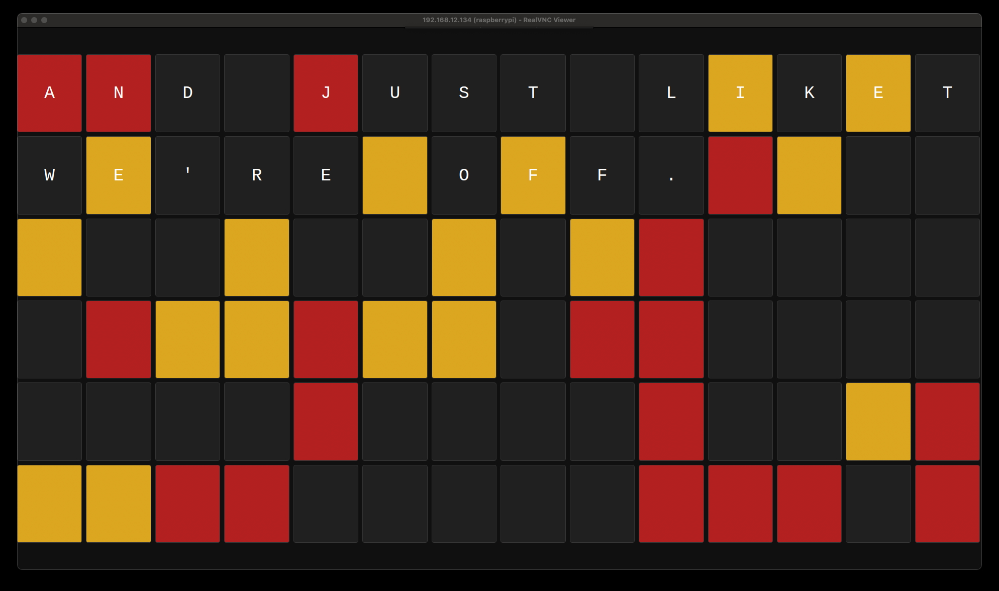

# Vestaboard-Style Flask Dashboard

A fullscreen dashboard built with Flask and displayed via Chromium on a Raspberry Pi — styled like the iconic Vestaboard.



---

## 🚀 Features

- Raspberry Pi-powered fullscreen display
- Flask app launches on boot
- Chromium runs in kiosk mode with GPU disabled for Pi 3 compatibility
- Random red/yellow tile effects to mimic Vestaboard aesthetics
- Ready for expansion: weather, calendar, system stats, media playback

---

## 📦 Project Structure

frametv/
└── vestaboard_flask/
├── app.py
├── templates/
├── static/
├── venv/ (ignored)
├── start_flask.sh
└── vesta.jpg

---

## 🛠 Setup Guide

### Requirements
- Raspberry Pi 3B+ or newer
- Raspberry Pi OS (Bookworm)
- Python 3
- Flask

### Installation

```bash
git clone git@github.com:mesatowne/vestaboard-flask.git
cd vestaboard-flask
python3 -m venv venv
source venv/bin/activate
pip install flask'''

@reboot /home/admin/frametv/vestaboard_flask/start_flask.sh


# ~/.config/autostart/kiosk.desktop
[Desktop Entry]
Type=Application
Name=Dashboard
Exec=sh -c 'sleep 20; chromium-browser --kiosk --disable-gpu --no-sandbox http://localhost:5000'
X-GNOME-Autostart-enabled=true

---

### ✅ After Adding It:
1. Save it into your project as `README.md`
2. Commit + push:

```bash
git add README.md
git commit -m "Add polished README"
git push
