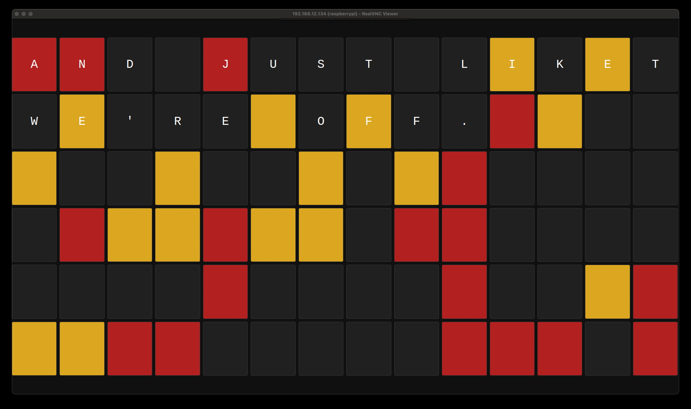

# Vestaboard-Style Flask Dashboard

A fullscreen dashboard built with Flask and designed to run in kiosk mode on a Raspberry Pi.



## What this repository contains

This repo contains a **Python/Flask web app** (`app.py`) plus static/template assets for rendering a Vestaboard-style screen.

It does **not** contain an iOS project (`.xcodeproj` / `.xcworkspace`). If you are looking for the iOS app from this link:

- `https://github.com/ngageoint/mage-ios`

that is a separate repository and should be cloned/built independently.

## Project Structure

```text
vestaboard-flask/
├── app.py
├── templates/
│   └── index.html
├── static/
│   └── css/style.css
├── vesta.jpg
└── README.md
```

## Run locally (Raspberry Pi)

### 1) Install system dependencies

```bash
sudo apt update
sudo apt install -y python3 python3-venv python3-pip chromium-browser
```

### 2) Clone and set up Python environment

```bash
git clone https://github.com/mesatowne/vestaboard-flask.git
cd vestaboard-flask
python3 -m venv venv
source venv/bin/activate
pip install --upgrade pip flask
```

### 3) Start the app

```bash
python app.py
```

Then open:

- `http://localhost:5000` (from the Pi)
- `http://<your-pi-ip>:5000` (from another device on your network)

## Show it fullscreen on the Pi (kiosk)

Create an autostart file:

```bash
mkdir -p ~/.config/autostart
nano ~/.config/autostart/kiosk.desktop
```

Paste:

```ini
[Desktop Entry]
Type=Application
Name=Vestaboard Dashboard
Exec=sh -c 'sleep 10; chromium-browser --kiosk --disable-gpu --no-sandbox http://localhost:5000'
X-GNOME-Autostart-enabled=true
```

## Optional: start Flask on boot

Create a launcher script in the repo root:

```bash
cat > start_flask.sh <<'SH'
#!/usr/bin/env bash
cd /home/pi/vestaboard-flask
source venv/bin/activate
python app.py
SH
chmod +x start_flask.sh
```

Then add a crontab entry:

```bash
crontab -e
```

Add:

```cron
@reboot /home/pi/vestaboard-flask/start_flask.sh
```

## iOS app note

If your goal is to also run/view the **MAGE iOS app**, use the separate repo:

```bash
git clone https://github.com/ngageoint/mage-ios.git
```

Open the iOS project in Xcode from that cloned directory (on a Mac with Xcode installed). This Flask repository is not an iOS codebase.
